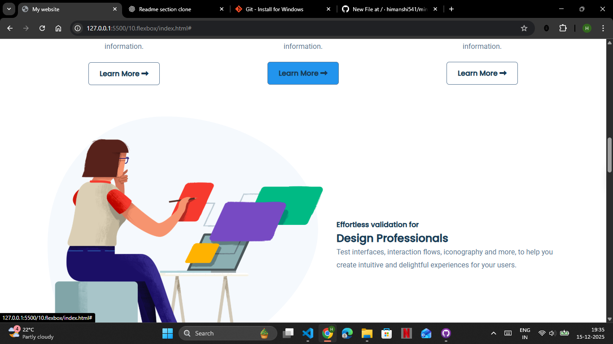

## 📌 UsabilityHub – Frontend Clone

### 🔍 Project Overview

This project is a **frontend clone of the UsabilityHub website**, created to practice and demonstrate modern **UI/UX design principles** and **responsive web development**. The goal of this clone is to replicate the **layout, structure, and user interface** of UsabilityHub while focusing purely on the **frontend experience**.

> ⚠️ **Disclaimer:** This project is for **educational purposes only** and is not affiliated with or endorsed by UsabilityHub.

---

### 🎯 Objectives

* Recreate the **visual design and layout** of UsabilityHub
* Practice **HTML, CSS, and JavaScript**
* Improve understanding of **responsive design**
* Build a clean, professional **frontend portfolio project**

---

### 🛠️ Technologies Used

* **HTML5** – Page structure and semantic elements
* **CSS3** – Styling, Flexbox, Grid, animations
* **JavaScript (ES6)** – Interactivity and dynamic behavior
* **Google Fonts & Icons** – Typography and UI enhancement

---

### ✨ Features

* Responsive navigation bar
* Hero section with call-to-action buttons
* Feature sections showcasing usability tools
* Testimonials and trusted brands section
* Fully responsive design (Mobile, Tablet, Desktop)
* Clean and modern UI inspired by UsabilityHub

---
## 📸 Screenshots

### Homepage


### Features Section



### 📱 Responsive Design

The website is **fully responsive**, ensuring smooth user experience across:

* 📱 Mobile Devices
* 💻 Laptops
* 🖥️ Desktop Screens

---

### 🚀 How to Run the Project

1. Clone the repository

   ```bash
   git clone https://github.com/himanshi541/miniproject-repo.git
   ```
2. Navigate to the project folder

   ```bash
   cd miniproject-repo
   ```
3. Open `index.html` in your browser

---

### 📁 Project Structure

```
usabilityhub-clone/
│
├── index.html
├── style.css
├── script.js
├── assets/
│   ├── images/
│   └── icons/
└── README.md
```

---

### 📌 Future Enhancements

* Add animations using **GSAP / Framer Motion**
* Convert to **React.js**
* Improve accessibility (ARIA roles)
* Integrate backend APIs for real user testing data

---

### 👩‍💻 Author

**Khushi Goyal**
Frontend Developer | UI/UX Enthusiast

---

### ⭐ Acknowledgements

* Inspired by the original **UsabilityHub** website
* Design references taken for learning and practice


